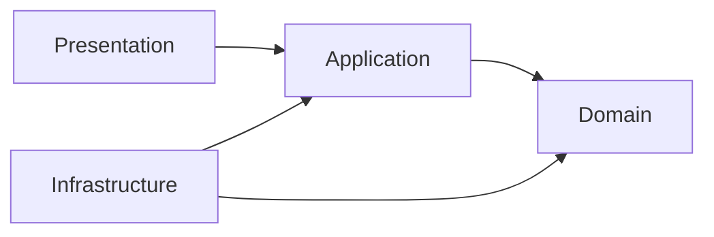
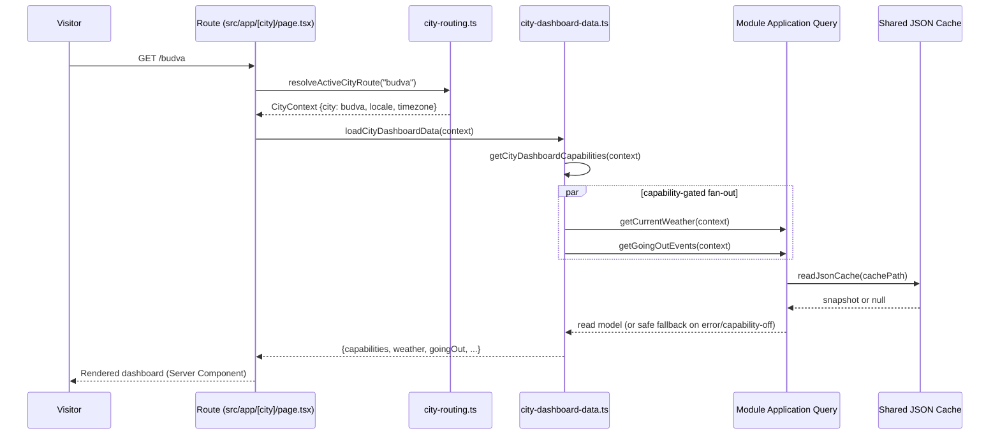
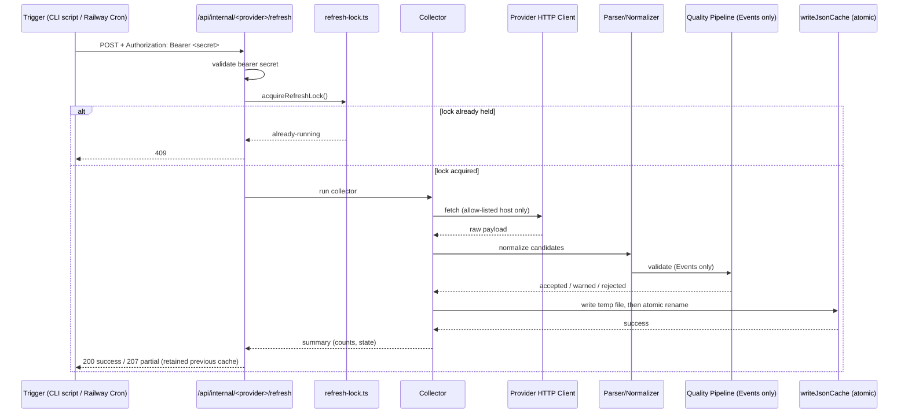
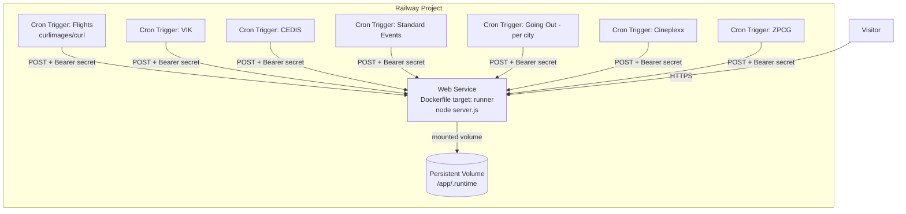

# Architecture — Gradom.me Platform

This document is a deep engineering-level architecture reference, complementary to [CLAUDE.md](CLAUDE.md) (project memory) and `docs/ARCHITECTURE.md` (product-facing architecture specification governed by `AGENTS.md`). Where the two overlap, `docs/ARCHITECTURE.md` remains the authoritative product specification; this document exists to explain *how* the system behaves at request- and refresh-time, for someone implementing or debugging it.

## 1. System Overview

Gradom.me is a Next.js 15 (App Router) + React 19 + TypeScript modular monolith. It has no database; all "server state" beyond in-request computation is a set of module-owned JSON snapshots on disk, written by out-of-band collectors and read by the web process.

```mermaid
graph TD
    subgraph "Visitor Request Path"
        A[Browser] --> B[Next.js App Router]
        B --> C[Route: src/app/[city]/...]
        C --> D[CityContext resolution]
        D --> E[Module Application Layer]
        E --> F[Cache Read - JSON snapshot]
        F --> G[Presentation Read Model]
        G --> A
    end

    subgraph "Refresh Path - never triggered by a visitor"
        H[CLI / Railway Cron Trigger] --> I[Internal Refresh Endpoint or CLI script]
        I --> J[Collector]
        J --> K[Provider HTTP Client - allow-listed host]
        K --> L[Parser / Normalizer]
        L --> M[Quality + Dedup - Events only]
        M --> N[Atomic JSON Cache Write]
    end

    N -.written to.-> F
```

## 2. Layered Architecture



- **Presentation**: routes, React components, loading/empty/stale/error states, accessibility behavior. Default to Server Components.
- **Application**: use-case coordination (e.g. `getCityEvents`, `getCurrentWeather`, `loadCityDashboardData`), no provider-specific detail.
- **Domain**: business types, validation rules, interfaces (e.g. `event.ts`, `event-quality.ts`, `city-alert.ts`, `flight.ts`). No framework or vendor SDK imports.
- **Infrastructure**: provider HTTP clients, parsers, cache adapters, collectors, locks.

Enforced module boundary: a module may import stable `shared` contracts/presentation primitives, but never another module's internals, provider client, or persistence implementation directly.

## 3. Request Lifecycle



Key properties:
- Route resolution is capability-aware: a route/section only renders if the active city registry entry declares the capability **and** the corresponding feature flag is enabled.
- Every dashboard data source is wrapped in `.catch()` at the fan-out level — a single provider failure degrades that section only, it never fails the whole page.
- `export const revalidate = 0` on city pages — Next.js does not cache the route render itself; freshness is entirely governed by the underlying JSON snapshot's own freshness calculation.

## 4. Refresh Lifecycle



On any unrecoverable failure, the collector retains the previously valid snapshot rather than overwriting it with empty/partial data — this is why a "suspicious-empty-result" style failure mode exists as a deliberate safety check rather than a silent bad write.

## 5. Collectors

Every collector follows: `official source → HTTP client (host allow-listed) → parser/normalizer → [quality pipeline, Events only] → atomic cache write`.

| Provider | Module | Trigger | Cache file (relative to `RUNTIME_DATA_DIR/cache`) |
|---|---|---|---|
| CEDIS (power outages, Podgorica + Budva) | `city-alerts` | `pnpm run collect:cedis` / `/api/internal/cedis/refresh` | `cedis-planned-outages.json` (Podgorica), `cedis-planned-outages-budva.json` (Budva) — see note below |
| VIK Podgorica (water) | `city-alerts` | `pnpm run collect:vikpg` / `/api/internal/vikpg/refresh` | `vikpg-water-alerts.json` |
| KIC Budo Tomović | `events` | `pnpm run collect:kic-events`, bundled into `pnpm run events:refresh-standard` / `/api/internal/events/standard/refresh` | `kic-events.json` |
| CNP | `events` | `pnpm run collect:cnp-events`, bundled into `pnpm run events:refresh-standard` / `/api/internal/events/standard/refresh` | `cnp-events.json` |
| Glavni Grad Podgorica | `events` | `pnpm run collect:glavni-grad-events`, bundled into `pnpm run events:refresh-standard` / `/api/internal/events/standard/refresh` | `glavni-grad-events.json` |
| Tourism Podgorica | `events` | `pnpm run collect:tourism-events`, bundled into `pnpm run events:refresh-standard` / `/api/internal/events/standard/refresh` | `tourism-events.json` |
| Cineplexx Podgorica (rendered via headless Chromium) | `events` | `pnpm run collect:cineplexx-events` / `/api/internal/cineplexx/refresh` (intentionally excluded from the standard-events bundle) | `cineplexx-events.json` |
| MonteGigs (Going Out, per active city) | `going-out` | `pnpm run collect:montegigs-going-out` / `/api/internal/going-out/refresh?city=<id>` | `montegigs-going-out.json` (+ per-city siblings) |
| Podgorica Airport Flights | `flights` | `pnpm run collect:podgorica-flights` / `/api/internal/flights/refresh` | `podgorica-flights.json` |
| ŽPCG Railway | `transport` | `pnpm run collect:zpcg-railway` / `/api/internal/zpcg/refresh` | `zpcg-railway-departures.json` |

Weather is the one exception — it calls Open-Meteo live during server rendering, with its own defined safe-failure state, rather than going through the collector/cache pattern.

**CEDIS multi-city detail (verified from `cedis-cache.ts` / `cedis-cities.ts` / `collect-cedis.ts`, not inferred):** `runActiveCedisCollectors()` collects every active city with the `electricity` capability and CEDIS support (currently Podgorica and Budva) sequentially in one process, sharing one memoized HTTP client so the single CEDIS listing page is fetched once and parsed per municipality heading (`"Podgorica" | "Glavni grad Podgorica"` vs. `"Budva" | "Opština Budva"`). Budva's cache path is *derived*, not independently configured: `join(dirname(CEDIS_CACHE_PATH), "cedis-planned-outages-budva.json")`. Each city has its own lock file (`.cedis-refresh-<cityId>.lock`) and its own structured JSON summary log line (`cityId`, `cachePath`, `cacheStatus`, `alertCount`, `status`, `retainedPreviousSnapshot`, `warnings`, optional `errorCode`) — the collector already logs per-city, it does not currently log a `collector` name field or a fetched/parsed/rejected count breakdown. See [CLAUDE.md §7](CLAUDE.md#7-cache--snapshot-architecture) for the canonical version of this fact and [CURRENT_STATUS.md](CURRENT_STATUS.md) for what remains unproven about it in production.

## 6. Cache

`src/shared/lib/cache.ts` provides the shared primitives:
- `writeJsonCache`: writes to `<path>.tmp`, then renames atomically over `<path>` — readers never observe a partially-written file.
- `readJsonCache`: parses the JSON file; returns `null` on any read/parse failure (missing file, corrupt content) rather than throwing.
- `calculateCacheFreshness(fetchedAt, now, maxAgeMinutes)`: returns `"fresh" | "stale" | "unavailable"`.

`src/shared/lib/refresh-lock.ts` provides `acquireRefreshLock`: creates an exclusive lock file (`wx` flag), detects and recovers stale locks (default 30-minute staleness threshold), and returns a `release()` function. This prevents two overlapping refreshes of the same provider from racing on the same cache file.

## 7. Snapshots

Each module defines its own snapshot schema (TypeScript type) and owns (de)serialization of its own cache file — there is no shared/generic "snapshot" type across modules, only a shared *mechanism* (`cache.ts`). Legacy snapshot shapes are backfilled defensively on read where documented (e.g. Events cache snapshots without quality diagnostics receive safe zero-value defaults; event records missing the newer single `cityId` are backfilled from legacy `cityIds`).

## 8. Application Layer

Application-layer functions (e.g. `getCityEvents`, `getCurrentWeather`, `getPodgoricaFlights`, `getGoingOutEvents`, `getRailwayDepartures`) are the only thing route/presentation code calls. They:
- Accept a `CityContext`.
- Read from cache (or call the live weather provider).
- Return a typed read model shaped for presentation, not the raw cache/provider schema.
- Are composed via dependency injection in dashboard-loading code (`CityDashboardDependencies` in `city-dashboard-data.ts`), which is what makes the fan-out testable without hitting real caches.

## 9. Domain Layer

Owns pure business rules with zero framework/vendor dependency, e.g.:
- `events/domain/event.ts`, `event-normalization.ts`, `event-deduplication.ts`, `event-quality.ts`, `event-time.ts`
- `city-alerts/domain/city-alert.ts`
- `flights/domain/flight.ts`
- `going-out/domain/going-out-event.ts`
- `transport/domain/railway-departure.ts`, `bus-station.ts`
- `daily-overview/domain/daily-overview.ts`, `daily-overview-generator.ts`

## 10. Infrastructure Layer

Owns everything that talks to the outside world or the filesystem: HTTP clients (host-allowlisted per provider, e.g. `cedis-http-client.ts`, `vikpg-http-client.ts`, `kic-http-client.ts`, `cnp-http-client.ts`, `tourism-http-client.ts`, `glavni-grad-http-client.ts`), parsers (`cineplexx-programme-parser.ts`, `kic-event-parser.ts`, `cnp-event-parser.ts`, `tourism-event-parser.ts`, `glavni-grad-event-parser.ts`), the Cineplexx headless-browser renderer, cache read/write wrappers per provider, and the collector entry scripts themselves.

## 11. Presentation Layer

Server Components by default. Module-owned UI models (e.g. `events-ui-model.ts`, `power-outages-ui-model.ts`, `going-out-ui-model.ts`) translate application read models into exactly what the component needs to render, including localized copy (`*-translations.ts` files) and freshness/state presentation. Client boundaries are small and explicit — e.g. the Events filter sheet is the only significant client-side interactive surface documented in the Events module.

## 12. Shared Modules

`src/shared/`:
- `components/` — typed, accessible, responsive UI primitives and shell/layout/theme components. No domain workflows or provider calls.
- `config/` — `cities.ts` (registry), `features.ts` (flags), `locale.ts`, `public-routes.ts`, `site.ts`. Non-secret only.
- `hooks/` — reusable UI-level hooks with no domain ownership.
- `lib/` — `cache.ts`, `date.ts`, `refresh-lock.ts`, `refresh-auth.ts`, `snapshot-diagnostics.ts`, `translations.ts`, `roving-tab-index.ts`, `utils.ts`.
- `types/` — cross-cutting presentation/infrastructure contracts only (`city.ts`, `provider.ts`). Domain types stay module-owned.

Promotion to `shared` requires at least two independent consumers with the same stable need, or an established platform primitive (AGENTS.md §7).

## 13. Routing

App Router structure:
- `src/app/page.tsx` — platform root homepage (`/`), lists active cities, does not render a city dashboard (ADR 0023).
- `src/app/[city]/page.tsx` — per-city dashboard, `generateStaticParams` from `getActiveCities()`, resolved via `resolveActiveCityRoute(slug)`, 404s (`notFound()`) for inactive/unknown slugs.
- `src/app/[city]/dogadjaji`, `izlasci`, `letovi`, `struja`, `filmovi` — capability-gated sub-routes.
- `src/app/events/[eventId]` and `src/app/[city]/dogadjaji/[eventId]` — event detail routes.
- `src/app/api/internal/**` — protected refresh endpoints.
- `src/app/api/health`, `src/app/api/readiness` — public liveness/readiness endpoints (no internal detail leaked).
- `src/app/kontakt`, `o-platformi`, `politika-privatnosti`, `uslovi-koriscenja` — global root routes (contact, about, legal).

Route availability is derived, not hardcoded: `getCityDashboardCapabilities`, `isCityPublicFeatureRouteAvailable`, and `getCitySitemapPaths` all combine the city registry with feature flags to decide what exists.

## 14. Feature Flags

`src/shared/config/features.ts` defines a typed `featureFlags` object (camelCase keys) sourced partly from `env.ts` `ENABLE_*` booleans and partly hardcoded (`authentication: false`, `maps: false`, `search: false`, `airQuality: false`, `busStation: true`, `dailyOverview: true`, `contact: true`). `isFeatureEnabled(feature)` is the only sanctioned read path — no scattered flag literals.

Flags are gates at composition boundaries (routes, nav, dashboard fan-out), not deep in domain logic, and are not authorization controls.

## 15. Capability System

See [CLAUDE.md §4](CLAUDE.md#4-capability-system) for the conceptual summary. Mechanically: `City.capabilities: readonly CityCapability[]` (registry) × `Feature` flag (env-derived) → `getCityDashboardCapabilities(context)` / `isCityPublicFeatureRouteAvailable(city, capability)` → what routes exist, what the dashboard fetches, what the sitemap includes.

## 16. City Registry

`src/shared/config/cities.ts`. `validateCityRegistry` runs at module load and throws if: any entry has an empty id/slug, the registry key doesn't match `city.id`, ids or slugs collide, there isn't exactly one `isMain` city, or the main city isn't `isActive`. `podgorica` is `isMain: true`. `bar` and `niksic` exist as `isActive: false` planning entries with empty `capabilities`.

## 17. Railway Deployment Architecture



The owner-confirmed facts behind this diagram (Railway is production, volume path, cron-driven refresh, and why push permission equals deploy permission on this project) are documented once, canonically, in [CLAUDE.md §9](CLAUDE.md#9-railway-production-notes-owner-confirmed-authoritative) — refer there rather than this section for the authoritative statement; this section exists only for the visual/topology diagram above.

`runtime-entrypoint.sh` (used by the `runner` image) creates and `chown`s `RUNTIME_DATA_DIR/cache` and `EVENT_CACHE_DIR` before `exec`ing the app as the non-root `nextjs` user — this exists specifically because a mounted Railway Volume replaces the image directory's ownership metadata at runtime, not build time.

`src/instrumentation.ts` runs once at production process boot: if a CEDIS/VIK/Events/Flights/Going-Out cache is missing or unusable, it triggers one non-blocking initialization refresh. This makes a freshly-mounted empty volume useful on first deploy; it is explicitly **not** a recurring scheduler.

## 18. Scheduler Architecture

Two distinct scheduler mechanisms exist in the repository; only one is active in production per the owner:

1. **VPS shell-loop scheduler** (`scripts/scheduler-entrypoint.sh`, the Docker `scheduler` target) — a `while true` loop checking local time against a case statement, running each collector at its documented cadence (Flights 15min, VIK 2h, CEDIS 6h, standard events 3h, MonteGigs 3h, Cineplexx 2×/day, ŽPCG 2×/day). **Documented for the VPS topology; not confirmed active in current production.**
2. **Railway cron trigger services** — small external `curlimages/curl` services, one per job, calling `/api/internal/<provider>/refresh` with a bearer secret on a cron schedule defined in the Railway dashboard (outside this repo). **This is the active production mechanism per owner confirmation.**

## 19. Testing Architecture

- Runner: Node.js built-in `node --test`, invoked via `pnpm run test` (glob over all `src/**/*.test.ts`) or narrower `pnpm run test:flights` / `test:going-out` scripts.
- Path aliases in tests are registered via `scripts/register-test-path-aliases.mjs`, loaded with `--import`.
- Collector/provider tests use fixture HTML/JSON files (`__fixtures__/`) and injected HTTP clients — never live network calls, enforced by convention (AGENTS.md §24) rather than a technical sandbox.
- Coverage by design: Daily Overview, Event Platform domain/query/provider boundaries, CEDIS/VIK/KIC/CNP/Glavni Grad/Tourism/Cineplexx/ŽPCG parser+refresh+cache+collector+integration paths, Events presentation filtering/grouping. The exact number of test files changes as the codebase grows and is intentionally not recorded here as a static count — run `find src -name '*.test.ts' -o -name '*.test.tsx' | wc -l` for the current figure.
